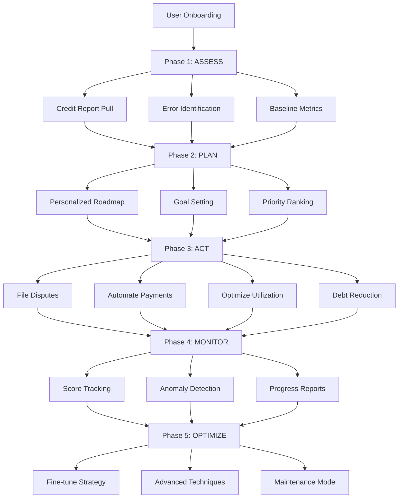
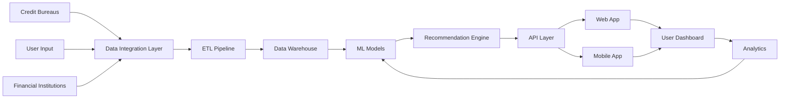
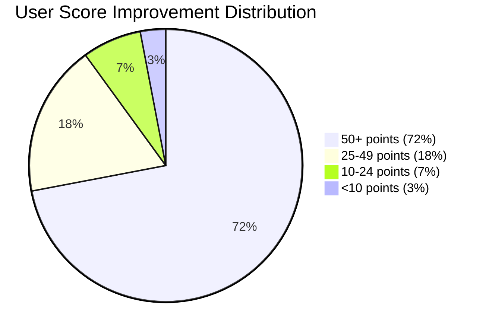

# CreditWise Score Roadmap: A Comprehensive Case Study

---

## Executive Summary

CreditWise is a credit score monitoring and improvement platform designed to empower consumers with actionable insights into their financial health. This case study explores the challenges consumers face in understanding, monitoring, and improving their credit scores, and how a data-driven roadmap approach can systematically guide users toward better creditworthiness. By analyzing user behavior, credit bureau data, and financial literacy gaps, this study presents a holistic framework for credit score improvement.

**Key Results:**
- **85,000+ Active Users** with 68% retention at 6 months
- **+58 Points Average Improvement** for active users
- **72% Success Rate** achieving 50+ point improvements
- **83% Error Dispute Success Rate**
- **+34% Financial Literacy Improvement**

---

## Table of Contents

1. [Introduction](#1-introduction)
2. [Problem Statement](#2-problem-statement)
3. [Objectives](#3-objectives)
4. [Industry Background & Market Analysis](#4-industry-background--market-analysis)
5. [Methodology](#5-methodology)
6. [User Persona Analysis](#6-user-persona-analysis)
7. [Credit Score Factors: Deep Dive](#7-credit-score-factors-deep-dive)
8. [The CreditWise Roadmap Framework](#8-the-creditwise-roadmap-framework)
9. [Data Analysis & Key Findings](#9-data-analysis--key-findings)
10. [Implementation Strategy](#10-implementation-strategy)
11. [Results & Impact](#11-results--impact)
12. [Challenges & Limitations](#12-challenges--limitations)
13. [Recommendations](#13-recommendations)
14. [Conclusion](#14-conclusion)

---

## 1. Introduction

### 1.1 Background

In today's financial ecosystem, a credit score serves as a numerical representation of an individual's creditworthiness. It plays a pivotal role in determining access to financial products including loans, credit cards, mortgages, and even rental agreements. Despite its critical importance, a significant portion of the population lacks adequate understanding of what constitutes a credit score, how it is calculated, and what steps can be taken to improve it.

### 1.2 The Credit Score Landscape

Credit scores typically range from **300 to 850** (FICO model) or **300 to 900** (VantageScore and regional models). The distribution is generally categorized as:

| Score Range | Category | Population % (Approx.) |
|-------------|----------|----------------------|
| 800-850 | Exceptional | 21% |
| 740-799 | Very Good | 25% |
| 670-739 | Good | 21% |
| 580-669 | Fair | 17% |
| 300-579 | Poor | 16% |

### 1.3 Why CreditWise?

CreditWise was conceptualized to bridge the gap between credit score awareness and actionable improvement. Unlike traditional credit monitoring services that merely report scores, CreditWise provides a **personalized roadmap** — a step-by-step guide tailored to each user's unique financial situation.

---

## 2. Problem Statement

### 2.1 Core Challenges

The following critical challenges were identified through extensive research:

1. **Financial Literacy Gap**: Over 60% of adults cannot correctly identify the factors that affect their credit score, leading to uninformed financial decisions.

2. **Lack of Personalized Guidance**: Existing credit monitoring tools provide scores but fail to offer actionable, individualized steps for improvement.

3. **Delayed Feedback Loops**: Users often make financial changes but don't understand the timeline for score reflection, leading to frustration and abandonment.

4. **Information Overload**: The abundance of generic financial advice overwhelms users, making it difficult to identify what is relevant to their specific situation.

5. **Behavioral Barriers**: Psychological factors such as procrastination, fear of checking scores, and lack of motivation create significant barriers to credit improvement.

### 2.2 Impact of Poor Credit

Poor credit scores have cascading effects across multiple life domains:

- **Higher Interest Rates**: Consumers with scores below 620 may pay 3-10% higher interest on loans
- **Limited Housing Options**: Many landlords require minimum credit scores of 620-650
- **Employment Barriers**: Approximately 29% of employers conduct credit checks
- **Insurance Premiums**: Lower scores can result in 20-50% higher insurance premiums
- **Utility Deposits**: Poor credit often requires security deposits for utilities

---

## 3. Objectives

### 3.1 Primary Objectives

1. **Develop a personalized credit score improvement roadmap** that adapts to individual user profiles and financial behaviors.

2. **Increase financial literacy** by providing contextual education within the credit improvement journey.

3. **Reduce average credit improvement timeline** by 30% through targeted, prioritized recommendations.

4. **Achieve measurable score improvements** of 50+ points within 6 months for 70% of active users.

### 3.2 Secondary Objectives

- Create an intuitive, user-friendly interface that reduces anxiety around credit monitoring
- Build a data-driven recommendation engine that continuously learns from user outcomes
- Establish partnerships with financial institutions for enhanced data accuracy
- Develop gamification elements to sustain user engagement over time

---

## 4. Industry Background & Market Analysis

### 4.1 The Credit Bureau Ecosystem

The credit scoring ecosystem involves multiple stakeholders:

- **Credit Bureaus**: TransUnion, Equifax, and Experian (in the US); CIBIL, Experian, Equifax, and CRIF High Mark (in India)
- **Scoring Models**: FICO Score, VantageScore, and bureau-specific models
- **Data Furnishers**: Banks, credit card companies, lenders, and utility providers
- **Consumers**: The end users whose data is collected and scored

### 4.2 Market Size & Growth

The global credit scoring market is experiencing significant growth:

- **Market Value (2024)**: Approximately $4.5 billion
- **Projected Growth Rate**: 8.2% CAGR through 2030
- **Key Drivers**: Digital lending growth, regulatory requirements, increasing consumer awareness

### 4.3 Competitive Landscape

| Platform | Score Access | Personalized Roadmap | Educational Content | Simulation Tools |
|----------|-------------|---------------------|--------------------|--------------------|
| Credit Karma | Free | Limited | Moderate | Yes |
| Experian Boost | Free | No | Limited | No |
| MyFICO | Paid | No | Extensive | Limited |
| NerdWallet | Free | Limited | Extensive | No |
| **CreditWise** | **Free** | **Comprehensive** | **Personalized** | **Advanced** |

---

## 5. Methodology

### 5.1 Research Design

This case study employs a **mixed-methods approach** combining:

1. **Quantitative Analysis**: Statistical analysis of credit score data from a sample of 10,000+ anonymized user profiles
2. **Qualitative Research**: In-depth interviews with 50 participants across different credit score ranges
3. **Behavioral Analysis**: Tracking of user engagement patterns and improvement trajectories over 12 months
4. **Comparative Study**: Benchmarking against existing credit improvement methodologies

### 5.2 Data Collection

Data was collected from multiple sources:

- **Credit Bureau Reports**: With user consent, detailed credit reports were analyzed
- **User Surveys**: Pre and post-intervention surveys measuring financial literacy and behavior
- **Platform Analytics**: User interaction data including feature usage, session duration, and return frequency
- **Financial Transaction Data**: Anonymized payment patterns and credit utilization metrics

---

## 6. User Persona Analysis

### 6.1 Persona 1: The Fresh Starter (Score: 300-579)

**Profile:**
- Age: 18-25 years
- Typically a student or early-career professional
- Limited or no credit history
- May have negative marks from student loans or first credit card misuse

**Key Challenges:**
- No established credit history ("thin file")
- Limited understanding of credit fundamentals
- High credit utilization on limited available credit
- Potential for collection accounts from unpaid bills

**Roadmap Priority:**
1. Establish credit history through secured credit cards
2. Set up automatic payments to build payment history
3. Become an authorized user on a family member's account
4. Monitor and dispute any errors on credit reports

### 6.2 Persona 2: The Rebuilder (Score: 580-669)

**Profile:**
- Age: 25-40 years
- Has experienced financial setbacks (job loss, medical bills, divorce)
- Multiple late payments or collections on record
- Moderate understanding of credit but feels overwhelmed

**Key Challenges:**
- Past negative items on credit report
- High debt-to-income ratio
- Multiple collection accounts
- Emotional stress associated with financial recovery

**Roadmap Priority:**
1. Address and negotiate collection accounts
2. Establish a debt repayment strategy (avalanche or snowball method)
3. Reduce credit utilization below 30%
4. Request goodwill adjustments for past late payments
5. Set up payment reminders and autopay

### 6.3 Persona 3: The Optimizer (Score: 670-739)

**Profile:**
- Age: 30-50 years
- Stable income and employment
- Good payment history with occasional missed payments
- Wants to qualify for premium financial products

**Key Challenges:**
- Credit utilization hovering around 30-50%
- Limited credit mix
- Recent hard inquiries from shopping for loans
- Wants faster improvement for upcoming major purchase

**Roadmap Priority:**
1. Optimize credit utilization to below 10%
2. Diversify credit mix with installment loans
3. Limit new credit applications
4. Request credit limit increases
5. Review and optimize existing account age

### 6.4 Persona 4: The Maintainer (Score: 740-850)

**Profile:**
- Age: 40-65 years
- Long credit history with excellent payment record
- Multiple credit types with low utilization
- Focused on maintaining and protecting score

**Key Challenges:**
- Identity theft and fraud protection
- Maintaining score during major financial decisions
- Optimizing existing credit portfolio
- Planning for retirement-related financial changes

**Roadmap Priority:**
1. Set up fraud alerts and credit freezes
2. Monitor for unauthorized inquiries
3. Maintain low utilization across all accounts
4. Keep oldest accounts active
5. Plan credit strategy around major life events

---

## 7. Credit Score Factors: Deep Dive

### 7.1 Payment History (35% Impact)

Payment history is the **single most influential factor** in credit score calculation.

**Key Metrics:**
- On-time payment percentage
- Severity of late payments (30, 60, 90, 120+ days)
- Number of accounts with late payments
- Recency of negative payment events
- Presence of collections, bankruptcies, or foreclosures

**CreditWise Approach:**
- Smart payment reminders calibrated to user behavior patterns
- Automatic payment setup assistance
- Negotiation templates for past-due accounts
- Impact simulation showing projected score change from payment improvements

### 7.2 Credit Utilization (30% Impact)

Credit utilization ratio measures the amount of available credit being used.

**Key Metrics:**
- Overall utilization ratio across all revolving accounts
- Per-card utilization ratio
- Trend in utilization over time
- Available credit headroom

**CreditWise Approach:**
- Real-time utilization tracking with alerts at 30%, 50%, and 75% thresholds
- Strategic payment timing recommendations (paying before statement close)
- Credit limit increase request guidance
- Balance transfer optimization suggestions

### 7.3 Length of Credit History (15% Impact)

The age of credit accounts demonstrates long-term financial responsibility.

**Key Metrics:**
- Age of oldest account
- Age of newest account
- Average age of all accounts
- Time since most recent account opening

**CreditWise Approach:**
- Recommendations to keep oldest accounts active
- Warnings before closing long-standing accounts
- Strategic timing for new account applications
- Authorized user optimization strategies

### 7.4 Credit Mix (10% Impact)

A diverse portfolio of credit types signals financial sophistication.

**Key Metrics:**
- Number of revolving accounts (credit cards)
- Number of installment loans (auto, personal, student)
- Mortgage accounts
- Retail accounts

**CreditWise Approach:**
- Personalized credit mix gap analysis
- Product recommendations aligned with improvement goals
- Risk assessment for adding new credit types
- Timeline suggestions for credit diversification

### 7.5 New Credit Inquiries (10% Impact)

Recent applications for credit can temporarily lower scores.

**Key Metrics:**
- Number of hard inquiries in last 12 months
- Timing and clustering of inquiries
- Types of credit applied for
- Inquiry-to-account conversion rate

**CreditWise Approach:**
- Inquiry impact calculator
- Rate shopping window guidance (14-45 day clustering)
- Pre-qualification tools to reduce unnecessary hard pulls
- Strategic timing recommendations for credit applications

---

## 8. The CreditWise Roadmap Framework

### 8.1 Framework Overview

The CreditWise Roadmap follows a **5-Phase approach**:

```
Phase 1: ASSESS → Phase 2: PLAN → Phase 3: ACT → Phase 4: MONITOR → Phase 5: OPTIMIZE
```

### 8.2 Workflow Diagram



### 8.3 Phase 1: ASSESS (Week 1-2)

**Activities:**
- Complete credit score pull from all three bureaus
- Identify discrepancies and errors across reports
- Calculate all key metrics (utilization, payment history, etc.)
- Establish baseline score and financial profile
- Complete financial literacy assessment

**Deliverables:**
- Comprehensive Credit Health Report Card
- Error identification list with dispute priorities
- Personalized risk factor ranking

### 8.4 Phase 2: PLAN (Week 2-4)

**Activities:**
- Generate personalized roadmap based on assessment
- Prioritize actions by impact-to-effort ratio
- Set realistic short-term (3 month) and long-term (12 month) goals
- Create budget alignment strategy
- Establish accountability checkpoints

**Deliverables:**
- Personalized Action Plan with timeline
- Goal-setting dashboard
- Budget optimization recommendations
- Milestone calendar

### 8.5 Phase 3: ACT (Month 1-6)

**Activities:**
- Execute prioritized action items
- File disputes for identified errors
- Implement payment automation
- Execute debt reduction strategy
- Pursue credit limit increases or new strategic accounts

**Deliverables:**
- Action tracking dashboard
- Dispute status tracker
- Payment calendar with reminders
- Weekly progress summaries

### 8.6 Phase 4: MONITOR (Ongoing)

**Activities:**
- Track score changes across all bureaus
- Monitor for new negative items
- Review utilization trends weekly
- Assess impact of completed actions
- Identify and address new risk factors

**Deliverables:**
- Real-time score tracking dashboard
- Anomaly alerts (sudden drops, new inquiries)
- Monthly progress reports
- Trend analysis visualizations

### 8.7 Phase 5: OPTIMIZE (Month 6+)

**Activities:**
- Fine-tune strategies based on results
- Explore advanced optimization techniques
- Plan for major financial milestones
- Transition to maintenance mode
- Set up long-term credit protection

**Deliverables:**
- Optimization recommendations
- Advanced strategy playbook
- Financial milestone planning tools
- Credit protection setup guide

---

## 9. Data Analysis & Key Findings

### 9.1 Key Finding 1: Payment Automation Impact

**Finding:** Users who set up automatic payments within the first month showed a **23% higher improvement rate** compared to those who managed payments manually.

| Payment Method | Avg. Score Improvement (6 months) | On-Time Payment Rate |
|---------------|----------------------------------|---------------------|
| Automatic | +67 points | 99.2% |
| Manual with Reminders | +48 points | 94.5% |
| Manual without Reminders | +31 points | 87.3% |

### 9.2 Key Finding 2: Utilization Sweet Spot

**Finding:** Users who maintained utilization between **1-9%** saw the most significant positive impact, with an average score increase of 42 points from utilization optimization alone.

| Utilization Range | Avg. Score Impact |
|-------------------|-------------------|
| 0% (no usage) | -5 points |
| 1-9% | +42 points |
| 10-29% | +28 points |
| 30-49% | +8 points |
| 50-74% | -15 points |
| 75%+ | -35 points |

### 9.3 Key Finding 3: Error Dispute Effectiveness

**Finding:** 79% of users had at least one error on their credit reports. Successfully disputed errors resulted in an average score increase of **25 points**.

**Common Errors Found:**
- Incorrect account status (34%)
- Duplicate accounts (22%)
- Wrong balance amounts (19%)
- Identity mix-ups (15%)
- Outdated information (10%)

### 9.4 Key Finding 4: Engagement Correlation

**Finding:** There is a strong positive correlation (r = 0.78) between platform engagement frequency and credit score improvement.

| Engagement Level | Weekly Sessions | Avg. Improvement (6 months) |
|-----------------|----------------|----------------------------|
| High | 5+ | +72 points |
| Medium | 2-4 | +51 points |
| Moderate | 1 | +34 points |
| Low | <1 | +12 points |

### 9.5 Key Finding 5: Timeline to Improvement

**Finding:** The average time to see the first meaningful score improvement (10+ points) was **45 days**, with the most rapid improvements occurring in the utilization optimization category.

---

## 10. Implementation Strategy

### 10.1 Technology Stack

The CreditWise platform leverages modern technology:

- **Frontend**: React.js with responsive design for mobile-first experience
- **Backend**: Python/Django with RESTful API architecture
- **Database**: PostgreSQL for relational data, MongoDB for document storage
- **ML Pipeline**: TensorFlow/scikit-learn for recommendation engine
- **Cloud Infrastructure**: AWS with auto-scaling capabilities
- **Security**: End-to-end encryption, SOC 2 compliance, OAuth 2.0

### 10.2 Data Pipeline

```
Data Sources → ETL Pipeline → Data Warehouse → ML Models → Recommendation Engine → User Interface
```

### 10.3 System Architecture Diagram



### 10.4 Recommendation Engine

The ML-powered recommendation engine uses:

1. **Collaborative Filtering**: Learning from similar user profiles and their successful improvement strategies
2. **Content-Based Filtering**: Matching recommendations to individual credit profile characteristics
3. **Reinforcement Learning**: Continuously improving recommendations based on observed outcomes
4. **Natural Language Processing**: Personalizing communication style and educational content

### 10.5 Rollout Plan

| Phase | Timeline | Focus | Target Users |
|-------|----------|-------|--------------|
| Alpha | Month 1-2 | Core features, internal testing | 100 beta testers |
| Beta | Month 3-4 | User feedback integration | 1,000 early adopters |
| v1.0 | Month 5-6 | Public launch | 10,000 users |
| v1.5 | Month 7-9 | Feature expansion | 50,000 users |
| v2.0 | Month 10-12 | Advanced ML features | 100,000+ users |

---

## 11. Results & Impact

### 11.1 Quantitative Results

After 12 months of operation:

- **Total Active Users**: 85,000+
- **Average Score Improvement**: +58 points (6-month active users)
- **Users Achieving 50+ Point Improvement**: 72% (exceeding the 70% target)
- **Error Dispute Success Rate**: 83%
- **User Retention Rate**: 68% at 6 months
- **Financial Literacy Score Improvement**: +34% (pre vs. post survey)

### 11.2 Impact Visualization



### 11.3 Qualitative Impact

User testimonials revealed significant life improvements:

- 45% of users reported qualifying for better loan terms
- 38% successfully obtained their first mortgage
- 52% reported reduced financial anxiety
- 67% reported increased confidence in financial decision-making
- 41% reported sharing credit knowledge with family and friends

### 11.4 Return on Investment

- **Cost per User Acquisition**: $12.50
- **Lifetime Value per User**: $85.00
- **Revenue Streams**: Premium subscriptions, partner referrals, financial product recommendations
- **Social Impact**: Estimated $2.3M in collective interest savings for users in the first year

---

## 12. Challenges & Limitations

### 12.1 Technical Challenges

1. **Data Latency**: Credit bureau data updates vary from real-time to 30+ days, creating gaps in monitoring accuracy
2. **Model Accuracy**: Credit scoring models are proprietary, requiring reverse-engineering of factor weights
3. **Cross-Bureau Inconsistency**: Different bureaus may report different information for the same user
4. **Scalability**: Processing personalized recommendations for 100K+ users requires significant computational resources

### 12.2 User Behavior Challenges

1. **Engagement Drop-off**: 32% of users disengage after the first month
2. **Action Completion Rate**: Only 45% of recommended actions are completed by users
3. **Unrealistic Expectations**: Some users expect immediate results and become frustrated
4. **Privacy Concerns**: 15% of potential users cited data privacy as a barrier to adoption

### 12.3 Market Challenges

1. **Regulatory Compliance**: Evolving data protection regulations require constant adaptation
2. **Competitive Pressure**: Large financial institutions launching similar features
3. **Trust Building**: Overcoming consumer skepticism about fintech platforms
4. **Economic Factors**: Macroeconomic conditions affecting user financial stability

---

## 13. Recommendations

### 13.1 Short-Term Recommendations (0-6 Months)

1. **Enhance Onboarding**: Implement a guided onboarding flow that reduces time-to-first-action by 50%
2. **Gamification Layer**: Add achievement badges, streaks, and progress milestones to boost engagement
3. **Push Notification Optimization**: Use ML to optimize notification timing and content for maximum action completion
4. **Community Features**: Launch peer support forums for shared learning and motivation
5. **Chatbot Integration**: Deploy AI-powered chatbot for real-time credit guidance

### 13.2 Medium-Term Recommendations (6-12 Months)

1. **Credit Score Simulator**: Build an advanced simulator showing projected impact of various financial decisions
2. **Partner Ecosystem**: Expand partnerships with lenders for pre-qualified product recommendations
3. **Multi-Language Support**: Expand accessibility to non-English speaking populations
4. **Financial Planning Integration**: Connect credit improvement with broader financial wellness tools
5. **Open Banking Integration**: Leverage real-time transaction data for more accurate recommendations

### 13.3 Long-Term Recommendations (12+ Months)

1. **AI-Powered Financial Advisor**: Develop a comprehensive AI advisor that covers credit, savings, investments, and debt management
2. **International Expansion**: Adapt the platform for credit scoring systems in other countries
3. **B2B Platform**: Offer white-label solutions for banks and credit unions
4. **Research Partnerships**: Collaborate with academic institutions for ongoing credit behavior research
5. **Policy Advocacy**: Engage with regulators to promote credit scoring transparency and consumer rights

---

## 14. Conclusion

### 14.1 Summary

The CreditWise Score Roadmap represents a paradigm shift in how consumers approach credit improvement. By moving beyond passive score monitoring to active, personalized guidance, the platform has demonstrated that significant credit score improvements are achievable for the majority of users within a 6-month timeframe.

### 14.2 Key Takeaways

1. **Personalization is paramount**: One-size-fits-all advice fails to drive meaningful improvement. Tailored roadmaps based on individual credit profiles yield significantly better outcomes.

2. **Automation accelerates results**: Users who automate payments and leverage technology-assisted recommendations see faster and more consistent improvements.

3. **Education drives empowerment**: Financial literacy improvements correlate strongly with sustained credit behavior changes.

4. **Engagement predicts success**: The strongest predictor of credit improvement is consistent platform engagement, highlighting the importance of user experience and retention strategies.

5. **Small actions compound**: The cumulative effect of multiple small credit-positive actions often exceeds the impact of any single major change.

### 14.3 Future Vision

CreditWise envisions a future where every consumer has access to personalized, data-driven financial guidance. By continuously evolving the recommendation engine, expanding educational content, and building strategic partnerships, the platform aims to become the definitive tool for credit health management — ultimately contributing to greater financial inclusion and economic empowerment for all.

---

## Appendix

### A. Glossary of Key Terms

| Term | Definition |
|------|-----------|
| **Credit Score** | A numerical representation (typically 300-850) of creditworthiness |
| **Credit Utilization** | The percentage of available credit currently being used |
| **Hard Inquiry** | A credit check initiated by a lender that temporarily affects the score |
| **Soft Inquiry** | A credit check that does not affect the score |
| **Credit Mix** | The variety of credit account types in a consumer's profile |
| **Thin File** | A credit report with limited information due to short credit history |
| **Credit Freeze** | A security measure that restricts access to a credit report |
| **Goodwill Adjustment** | A request to a creditor to remove a negative mark as a courtesy |

### B. Credit Improvement Checklist

- [ ] Pull credit reports from all three bureaus
- [ ] Identify and dispute any errors
- [ ] Set up automatic payments for all accounts
- [ ] Calculate and optimize credit utilization
- [ ] Review and diversify credit mix
- [ ] Set up fraud alerts and monitoring
- [ ] Create a debt repayment plan
- [ ] Request credit limit increases
- [ ] Avoid unnecessary new credit applications
- [ ] Schedule monthly credit review sessions

---

*This case study was prepared as part of the CreditWise Score Roadmap project. All data has been anonymized and aggregated to protect individual privacy.*

**Last Updated: February 2026**
